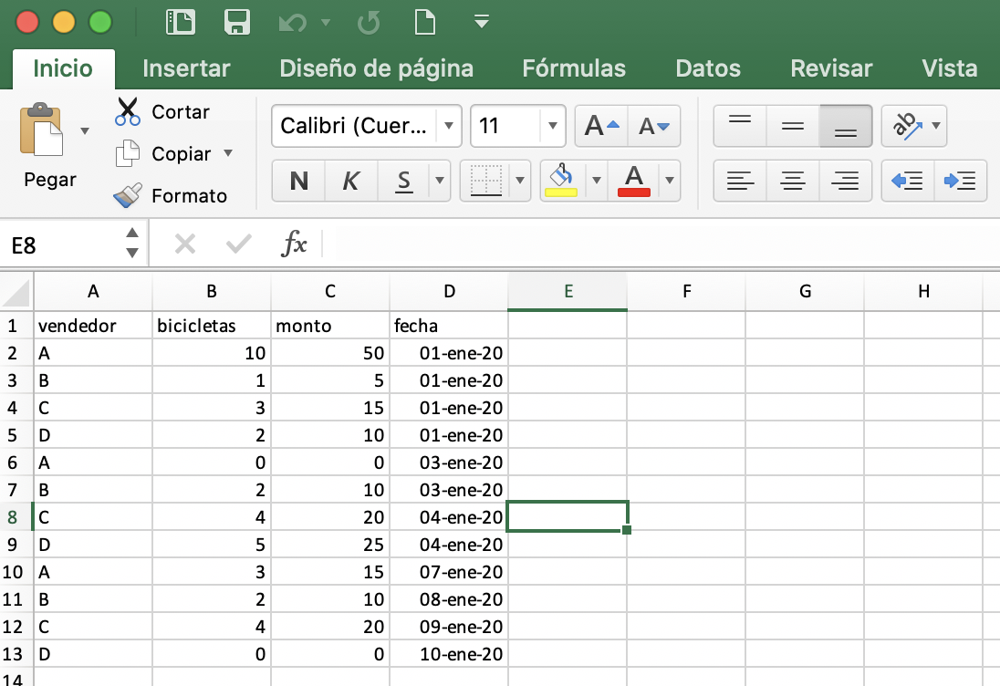
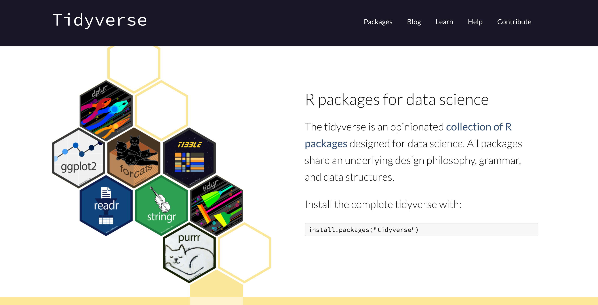

```{r setup, include=FALSE}
knitr::opts_chunk$set(echo = TRUE)
```

Supongamos que tenemos un negocio de bicicletas y almacenamos las ventas en un archivo de Excel

```{r, echo=FALSE, out.width = "600px"}
library(knitr)

```


La versión de R con la que trabajaremos es la siguiente:

```{r}
version
```

## Cargamos nuestra base de datos de Excel

```{r pressure, echo=FALSE}
library(readxl)
df <- read_excel('../data/bicicletas.xlsx')
kable(head(df))
```

## Gráficas

```{r, echo=FALSE, message=FALSE, warning=FALSE}
library(dplyr)
resumen <- df %>%
    group_by(vendedor) %>%
    summarise(cantidad_vendida = sum(bicicletas), monto = sum(monto), .groups = 'drop') %>%
    kable()
```


```{r, echo=FALSE, message=FALSE, warning=FALSE}
resumen <- df %>% group_by(vendedor) %>% summarise(cantidad_vendida = sum(bicicletas), monto = sum(monto), .groups = 'drop')
barplot(resumen$monto, main='Monto de las ventas por vendedor', col='orange', border=NA,
        ylab='Monto en miles de pesos', xlab='Vendedor', names.arg=resumen$vendedor)
```


```{r, echo=FALSE, message=FALSE, warning=FALSE}
resumen <- df %>% group_by(fecha) %>% summarise(monto = sum(monto), .groups = 'drop')
plot(resumen, type='b', col='blue', main='Evolución de las ventas')
```





